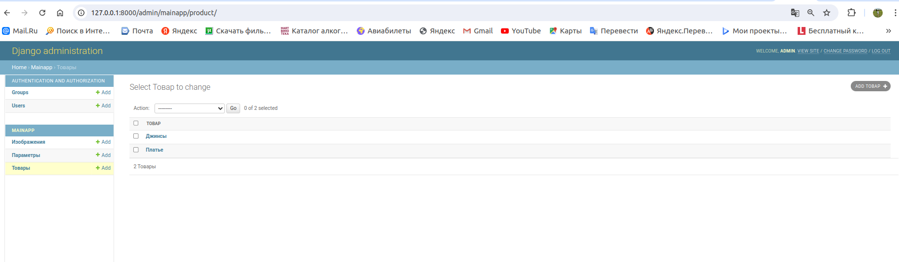
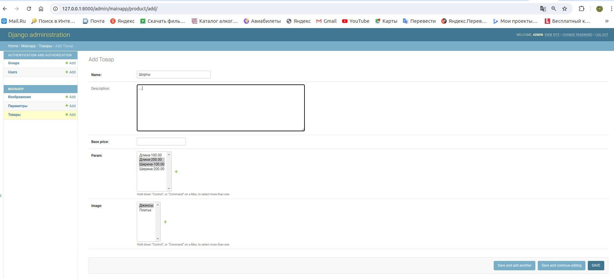
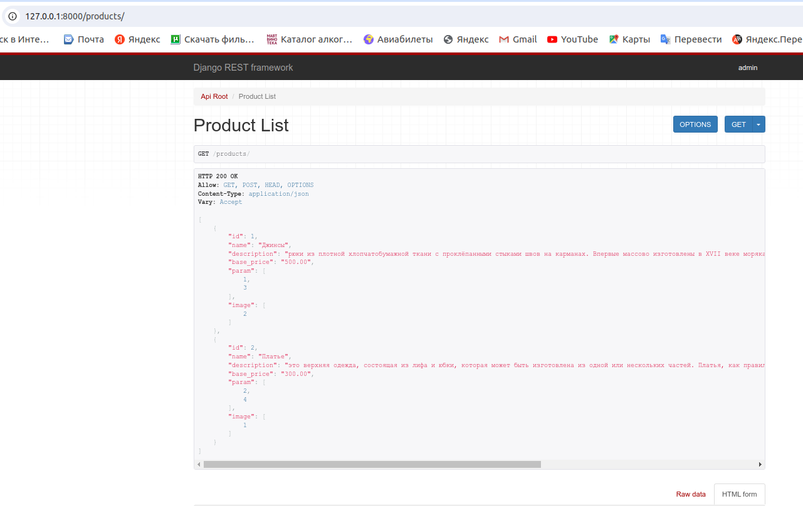
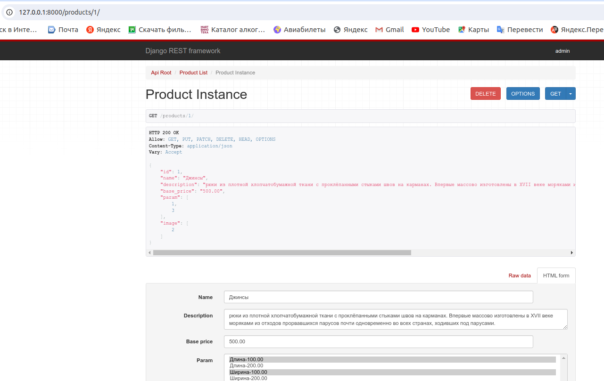
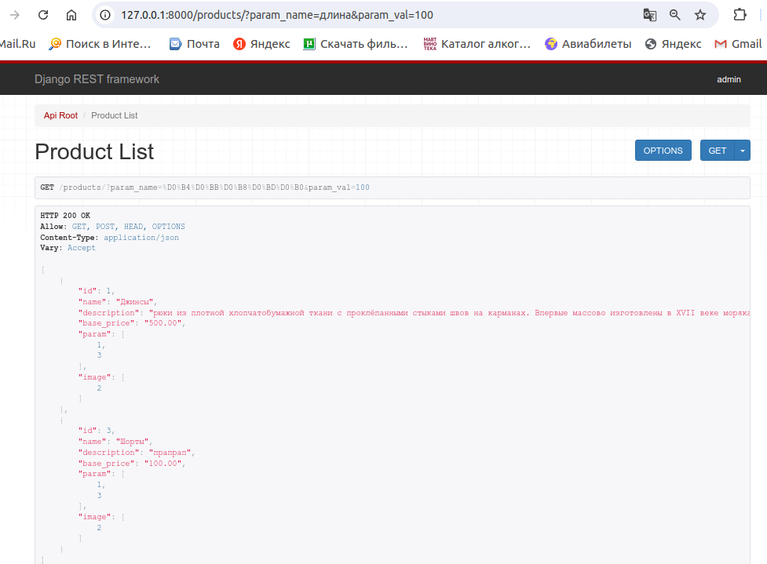
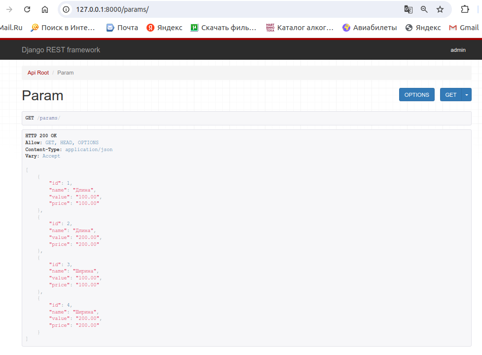
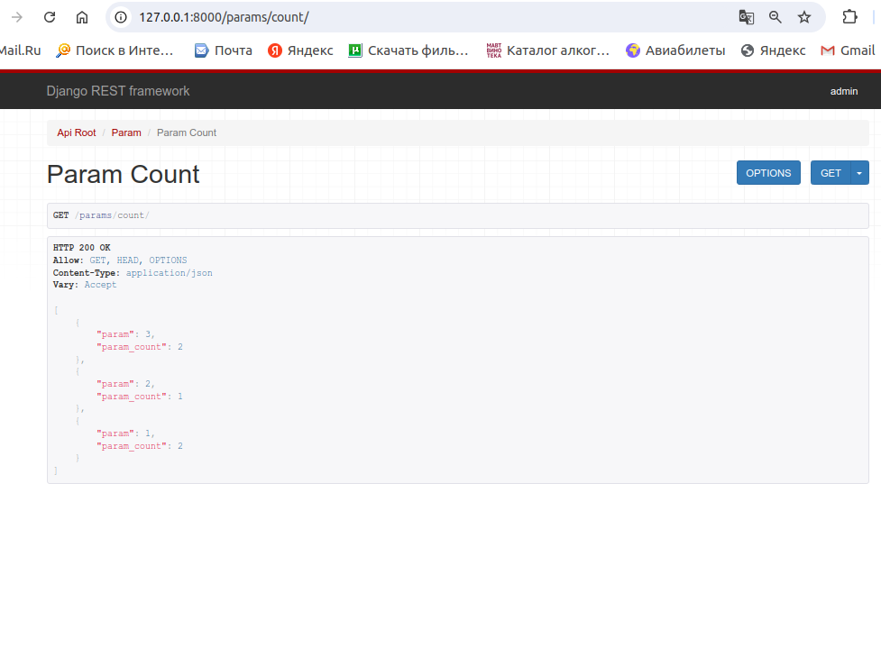

# Catalog_django

# Django admin

# Список товаров

# Детальная информация по товару

# Фильтр товаров по названию/значению параметров

# Список уникальных параметров, которые есть хотя бы у одного товара

# Параметр со значением у скольких товаров он есть

